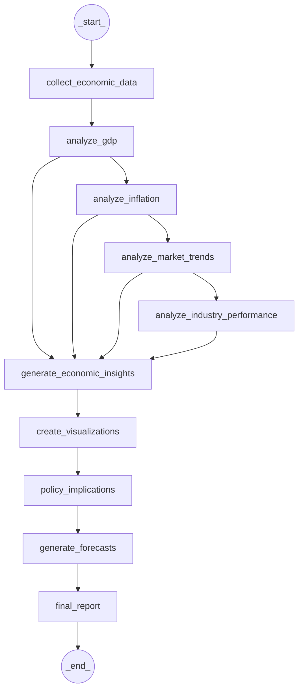

# 🏛️ LangGraph Economic Analysis System

A comprehensive, AI-powered economic analysis platform that leverages LangGraph to orchestrate sophisticated macroeconomic analysis workflows. The system integrates real-time economic data from authoritative sources, performs advanced economic analysis, and generates professional-grade reports with interactive visualizations.

## 🌟 Key Features

### 🤖 AI-Powered Economic Intelligence
- **LangGraph Workflow Orchestration**: Advanced multi-agent system for economic analysis
- **GPT-4 Economic Insights**: AI-generated economic narratives and strategic recommendations
- **Real-time Data Processing**: Live economic data with automated quality validation
- **Professional Report Generation**: Comprehensive economic reports in multiple formats
- **LangSmith Observability**: Comprehensive monitoring, debugging, and performance optimization

### 📊 Comprehensive Economic Analysis
- **Multi-Source Data Integration**: FRED (Federal Reserve), Alpha Vantage, and Yahoo Finance
- **50+ Economic Indicators**: GDP, inflation, employment, monetary policy, and market sentiment
- **Advanced Analytics**: Growth trends, inflation dynamics, labor market analysis
- **Cross-Indicator Correlations**: Sophisticated relationship analysis between economic variables

### 📈 Interactive Visualizations
- **Professional Dashboards**: Multi-panel economic analysis charts
- **Industry Performance Metrics**: Sector-specific analysis with employment and wage trends
- **Market Trends Analysis**: Interest rates, unemployment, consumer confidence, and industrial production
- **GDP & Inflation Analysis**: Comprehensive economic indicator visualizations
- **Correlation Heatmaps**: Economic indicator relationship analysis

### 🎯 Specialized Analysis Types
- **Industry Performance**: Technology, Healthcare, Energy sector analysis
- **Market Trends**: Interest rates, unemployment, consumer confidence analysis
- **GDP Analysis**: Economic growth, productivity, and expansion assessment
- **Inflation Analysis**: Price stability, CPI trends, and monetary policy implications
- **Comprehensive Analysis**: Full economic assessment across all major indicators

### 🔍 LangSmith Integration for Production-Ready AI
- **Real-time Performance Monitoring**: Track AI model performance across all workflow nodes
- **Debugging and Tracing**: Detailed insights into GPT-4 decision-making processes
- **Quality Assurance**: Continuous validation of AI-generated economic insights
- **Error Detection**: Automated identification of analytical inconsistencies
- **Cost Optimization**: API usage tracking and optimization recommendations
- **Workflow Analytics**: Performance metrics for continuous improvement

## 🚀 Quick Start

### Prerequisites
- **Python 3.11+** (Required for LangGraph compatibility)
- **OpenAI API Key** (Required for AI analysis)
- **FRED API Key** (Recommended for enhanced data access)
- **LangSmith API Key** (Optional for monitoring and debugging)

### 1. Installation

```bash
# Clone the repository
git clone https://github.com/YourUsername/LangGraph_Economic_Analysis.git
cd LangGraph_Economic_Analysis

# Create virtual environment with Python 3.11+
python3.11 -m venv venv311
source venv311/bin/activate  # On Windows: venv311\Scripts\activate

# Install dependencies
pip install -r requirements.txt
```

### 2. Environment Setup

```bash
# Create .env file with your API keys
cat > .env << EOF
OPENAI_API_KEY=your_openai_api_key_here
FRED_API_KEY=your_fred_api_key_here
LANGCHAIN_TRACING_V2=true
LANGCHAIN_ENDPOINT=https://api.smith.langchain.com
LANGCHAIN_API_KEY=your_langsmith_api_key_here
LANGCHAIN_PROJECT=economic-analysis-system
EOF
```

### 3. Basic Usage

```bash
# Run comprehensive economic analysis
python main_economic_analysis.py --analysis-type comprehensive --period 5y

# Focus on industry performance analysis
python main_economic_analysis.py --analysis-type industry --period 3y --focus-industries "Tech,Healthcare,Energy"

# Market trends analysis
python main_economic_analysis.py --analysis-type market_trends --period 2y

# GDP-focused analysis
python main_economic_analysis.py --analysis-type gdp --period 10y

# Inflation analysis
python main_economic_analysis.py --analysis-type inflation --period 5y
```

### 4. LangGraph Studio Integration

```bash
# Start LangGraph Studio for interactive workflow visualization
langgraph dev

# Access Studio UI at http://localhost:8123
# Visualize and interact with the economic analysis workflow
```

### 5. LangSmith Monitoring

With LangSmith properly configured, you can:

- **Monitor AI Performance**: Track response times, token usage, and quality metrics in real-time
- **Debug Workflows**: Trace each step of the economic analysis process with detailed logging
- **Optimize Costs**: Monitor API usage and identify optimization opportunities
- **Quality Assurance**: Validate AI-generated insights for accuracy and consistency
- **Performance Analytics**: Analyze workflow efficiency and identify bottlenecks

Access your LangSmith dashboard at [https://smith.langchain.com](https://smith.langchain.com) to view detailed analytics and traces.

## 🏗️ System Architecture

### LangGraph Economic Analysis Workflow

The system uses LangGraph to orchestrate a sophisticated 10-step economic analysis workflow that processes real-time data through AI-powered analysis to generate comprehensive reports and visualizations.



**Workflow Phases:**
1. **Data Collection & Analysis Phase**: Sequential processing of economic indicators (GDP → Inflation → Market Trends → Industry Performance)
2. **AI Processing & Output Phase**: Convergence of all analysis results into AI-powered insights, followed by visualization, policy analysis, forecasting, and final report generation

### Core Components

#### 1. **LangGraph Economic Agent** (`langgraph_economic_agent.py`)
- **10-Step Workflow Orchestration**: Data collection → Analysis → Insights → Visualization → Reporting
- **Conditional Routing**: Dynamic workflow paths based on analysis type
- **AI-Powered Analysis**: GPT-4 integration for economic insights generation
- **Professional Chart Generation**: PNG-format economic dashboards and visualizations
- **LangSmith Integration**: Comprehensive monitoring and debugging capabilities

#### 2. **Economic Data Agent** (`economic_data_agent.py`)
- **Multi-Source Data Fetching**: FRED API integration with comprehensive economic indicators
- **Data Quality Validation**: Automated data verification and error handling
- **Economic Dashboard Creation**: Professional visualizations with real-time data
- **Industry Performance Analysis**: Sector-specific employment and wage data

#### 3. **Economic Report Writer** (`economic_report_writer.py`)
- **AI-Generated Reports**: GPT-4 powered economic narratives
- **Multiple Report Formats**: Executive summaries, comprehensive analysis, policy briefs
- **Professional Styling**: Institutional-quality report formatting
- **Real-time Data Integration**: Live economic data in reports

#### 4. **Graph Visualizer** (`graph_visualizer.py`)
- **Workflow Visualization**: Interactive LangGraph workflow diagrams
- **Performance Metrics**: Execution time analysis and optimization insights
- **Data Flow Analysis**: Comprehensive workflow data flow visualization
- **Professional Dashboards**: Multi-panel workflow analysis charts

### Configuration System

#### **Economic Configuration** (`economic_config.py`)
- **Centralized Settings**: API keys, data sources, and analysis parameters
- **FRED Series Management**: Comprehensive economic indicator definitions
- **Output Directory Management**: Organized file structure for reports and charts
- **Validation System**: Automated configuration verification

#### **Studio Configuration** (`studio_config.py`)
- **LangGraph Studio Integration**: Seamless workflow visualization
- **Graph Export**: Optimized graph structure for Studio UI
- **Development Support**: Enhanced debugging and development experience

## 📊 Analysis Capabilities

### **Industry Performance Analysis**
- **Sector-Specific Metrics**: Technology, Healthcare, Energy industry analysis
- **Employment Trends**: Year-over-year employment growth analysis
- **Wage Analysis**: Compensation trends and sector comparisons
- **Performance Scoring**: Comprehensive industry performance metrics
- **Professional Visualizations**: Multi-panel industry comparison charts

### **Market Trends Analysis**
- **Interest Rate Analysis**: Fed Funds Rate and 10Y Treasury trends
- **Unemployment Dynamics**: Labor market health and trends
- **Consumer Confidence**: Economic sentiment and spending indicators
- **Industrial Production**: Manufacturing and production analysis
- **Yield Curve Analysis**: Interest rate spread and economic implications

### **GDP Analysis**
- **Economic Growth**: Real GDP level and growth rate analysis
- **Per Capita Analysis**: GDP per capita trends and comparisons
- **Growth Components**: Detailed GDP component analysis
- **Historical Context**: Long-term economic growth patterns

### **Inflation Analysis**
- **Price Stability**: CPI and Core CPI trend analysis
- **Inflation Metrics**: Multiple inflation indicator comparisons
- **PCE Analysis**: Personal Consumption Expenditures trends
- **Policy Implications**: Inflation impact on monetary policy

## 📈 Generated Outputs

### **Professional Charts** (PNG Format)
- **Industry Performance Dashboard**: 4-panel sector analysis
- **Market Trends Dashboard**: Interest rates, unemployment, confidence, production
- **GDP Analysis Dashboard**: Growth, per capita, and component analysis
- **Inflation Analysis Dashboard**: CPI, PCE, and inflation rate trends
- **Correlation Heatmaps**: Economic indicator relationship analysis

### **Comprehensive Reports** (TXT Format)
- **Executive Summaries**: Strategic insights for decision-makers
- **Detailed Analysis**: Comprehensive economic assessment with methodology
- **Policy Recommendations**: AI-generated strategic guidance
- **Economic Forecasts**: Short, medium, and long-term projections

### **Workflow Visualizations** (HTML Format)
- **Interactive Workflow Diagrams**: LangGraph workflow visualization
- **Performance Metrics**: Execution time and optimization analysis
- **Data Flow Analysis**: Comprehensive workflow data flow
- **Professional Dashboards**: Multi-panel workflow analysis

### **LangSmith Analytics**
- **Performance Dashboards**: Real-time monitoring of AI model performance
- **Trace Analysis**: Detailed execution logs for debugging and optimization
- **Quality Metrics**: Validation scores and consistency tracking
- **Cost Analytics**: API usage patterns and optimization insights

## 🎯 Use Cases

### **Policy Analysis**
- **Central Bank Research**: Monetary policy analysis and recommendations
- **Government Analysis**: Economic policy impact assessment
- **Academic Research**: Comprehensive economic data analysis
- **Think Tank Reports**: Policy-focused economic research

### **Investment Analysis**
- **Economic Intelligence**: Market-economy relationship analysis
- **Risk Assessment**: Economic scenario analysis and forecasting
- **Asset Allocation**: Economic cycle-based investment strategies
- **Due Diligence**: Economic environment assessment

### **Business Intelligence**
- **Strategic Planning**: Economic outlook for business decisions
- **Market Research**: Economic trends affecting industries
- **Risk Management**: Economic scenario planning
- **Competitive Analysis**: Economic factors affecting competition

## 📁 Project Structure

```
LangGraph_Economic_Analysis/
├── economic_config.py              # Centralized configuration and settings
├── economic_data_agent.py          # Core economic data fetching and processing
├── langgraph_economic_agent.py     # LangGraph workflow orchestration
├── economic_report_writer.py       # AI-powered report generation
├── main_economic_analysis.py       # Main application and CLI interface
├── graph_visualizer.py             # Workflow visualization and analysis
├── studio_config.py                # LangGraph Studio configuration
├── langgraph.json                  # LangGraph Studio project configuration
├── requirements.txt                # Python dependencies
├── .env.template                   # Environment variables (create this)
├── economic_charts/               # Generated economic visualizations
├── economic_reports/              # Generated economic reports
├── workflow_visualizations/       # Workflow analysis charts
└── README.md                      # This file
```

## 🔧 Advanced Features

### **LangGraph Studio Integration**
- **Interactive Workflow Visualization**: Real-time workflow monitoring
- **Graph Debugging**: Enhanced development and debugging experience
- **Performance Optimization**: Workflow efficiency analysis
- **Custom Workflow Development**: Extensible workflow architecture

### **AI-Powered Analysis**
- **GPT-4 Economic Insights**: Advanced economic narrative generation
- **Cross-Indicator Analysis**: Sophisticated relationship analysis
- **Policy Recommendations**: AI-generated strategic guidance
- **Forecasting**: Machine learning-enhanced economic predictions

### **Professional Visualization**
- **Multi-Panel Dashboards**: Comprehensive economic analysis charts
- **Interactive Elements**: Hover information and detailed metrics
- **Professional Styling**: Institutional-quality chart formatting
- **Export Capabilities**: PNG, HTML, and JSON output formats

### **LangSmith Observability**
- **Real-time Monitoring**: Track AI performance across all workflow steps
- **Detailed Tracing**: Debug AI decision-making processes with comprehensive logs
- **Quality Metrics**: Validate AI outputs for consistency and accuracy
- **Performance Analytics**: Optimize workflow efficiency and cost management
- **Error Detection**: Automated identification of issues and anomalies

## ⚠️ Important Disclaimers

### **Economic Analysis Disclaimer**
- This system is for **informational and educational purposes only**
- Economic forecasts are subject to **significant uncertainty and risk**
- Past economic performance **does not guarantee future results**
- Users should conduct **independent analysis** and consult qualified economists
- Economic conditions can **change rapidly and unpredictably**

### **Data Source Limitations**
- Analysis depends on **data quality from third-party sources**
- Economic indicators may be **revised by statistical agencies**
- **Time lags** in data publication may affect current assessments
- **API rate limits** may affect data availability and analysis frequency
- Data accuracy is subject to **source system limitations**

### **Investment and Policy Disclaimer**
- This system **does not constitute investment advice** or policy recommendations
- Economic analysis should not be the **sole basis for financial decisions**
- Consult **qualified financial advisors** before making investment decisions
- Policy recommendations should be **validated by economic experts**
- **No guarantee** of accuracy or completeness of analysis

### **Technical Disclaimer**
- System performance depends on **API availability and rate limits**
- **Network connectivity** required for real-time data access
- **Software updates** may affect functionality and compatibility
- **Backup and data retention** policies should be established
- **Security best practices** should be followed for API key management

### **Liability Disclaimer**
- **No warranty** of merchantability or fitness for particular purpose
- **No liability** for direct, indirect, or consequential damages
- Users assume **full responsibility** for analysis interpretation
- **Professional consultation** recommended for critical decisions
- **Use at your own risk** and discretion

## 🔐 Security and Best Practices

### **API Key Management**
- Store API keys in **environment variables** (`.env` file)
- **Never commit keys** to version control
- Use **separate keys** for development and production
- **Monitor API usage** and implement rate limiting
- **Rotate keys regularly** for security

### **Data Privacy**
- All processing happens **locally** unless using external APIs
- No economic data is **stored permanently** without user consent
- **Clear data retention** policies for cached information
- **Secure transmission** of API requests and responses

## 🙏 Acknowledgements

### **Federal Reserve Economic Data (FRED)**
For providing comprehensive, reliable economic data that serves as the foundation for all analysis conducted by this platform. FRED's extensive database of economic indicators enables sophisticated macroeconomic analysis and research.

### **OpenAI**
For the GPT-4 technology that powers the AI-enhanced economic analysis and insight generation capabilities. The advanced language model enables sophisticated interpretation of economic data and generation of professional-grade economic narratives.

### **LangGraph**
For the workflow orchestration framework that enables sophisticated multi-step economic analysis processes. LangGraph's state management and conditional routing capabilities make complex economic analysis workflows possible and maintainable.

### **LangSmith**
For the comprehensive observability, monitoring, and debugging platform that ensures production-ready AI performance. LangSmith's tracing and analytics capabilities enable continuous improvement and reliable operation of AI-powered economic analysis.

## 📄 License and Attribution

### **License**
This project is provided under the **MIT License** for educational and research purposes.

### **Data Attribution**
- **FRED Data**: Federal Reserve Bank of St. Louis (Public Domain)
- **OpenAI**: Subject to OpenAI API terms and conditions

**🎉 Ready to analyze the economy with AI-powered intelligence!**
